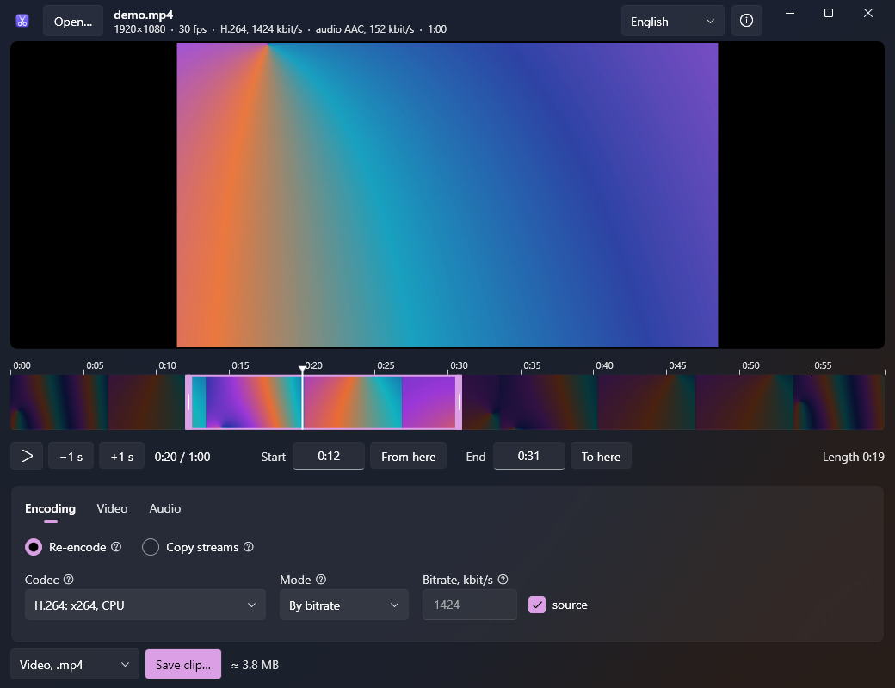

# VideoTrim

*[Русский](README.md)*

Cuts a clip out of a video through ffmpeg. Resolution, frame rate, codec and bitrate stay as
in the source by default and can be changed.



## Running

Requires the .NET 9 Desktop Runtime and `ffmpeg.exe` with `ffprobe.exe`, either next to the
program or in `PATH`. If they are missing, the program offers on startup to download the
essentials build from gyan.dev (115 MB) and puts both exe files next to itself, or into
`%LocalAppData%\VideoTrim\ffmpeg` when the program folder is not writable.

```bash
dotnet publish -c Release -r win-x64 --self-contained false -p:PublishSingleFile=true -o dist
```

A file is opened with the Open button, by dropping it onto the window or as a command line
argument.

## Usage

The start and end are set with the handles on the frame strip, with the input fields
(`1:25`, `1:02:05`) or with the From here and To here buttons at the current position. The
handles snap to whole seconds; the end can match the end of the file.

| Key | Action |
| --- | --- |
| Space | play and pause |
| ← → | one second, with Shift ten |
| I, O | clip start and end at the current position |
| Home, End | to the clip start and end |

Two ways to save:

* **Re-encode.** The clip is cut exactly on the second. Settings are on three tabs:
  * Encoding: encoder and bitrate, by default the source format and bitrate, or a quality
    mode (CRF, CQ, QP) in four levels; when the frame is made smaller, the source bitrate
    goes down as the pixel count ratio to the power of 0.75;
  * Video: downscaling through standard heights, keeping the aspect ratio or to 16:9, and a
    frame rate below the source;
  * Audio: copy the audio, re-encode it (AAC, MP3, Opus, AC-3, FLAC) or drop it.

  Frame timestamps are passed through as they are (`-fps_mode passthrough`), so the frame
  rate stays as in the source unless it is changed.
* **Copy streams.** `-c copy`: fast and lossless, but the start moves to the keyframe before
  the chosen point.

Next to the save button is the output format: video in the source container, GIF (15 frames
per second by default, with a palette built from the clip itself) or audio only in .m4a or
.mp3. The estimated file size from the bitrate and clip length is shown there too.

Hardware encoders (NVENC, Quick Sync, AMF) are listed only if a test encode of five frames
succeeds on startup: an ffmpeg build lists them whether or not the machine has a matching
graphics card.

The video is shown by the Windows player (Media Foundation). For formats it cannot open
(ProRes, some MPEG-2), the frame at the current position comes from ffmpeg, without playback.

## Language

The language is picked in the title bar, next to the About button. Russian and English are
built in. Translations are JSON files in `%AppData%\VideoTrim\lang`: they can be edited
without rebuilding, and a new file with another language code adds that language to the list.

Settings and the window position are stored in `%AppData%\VideoTrim\config.json`.
